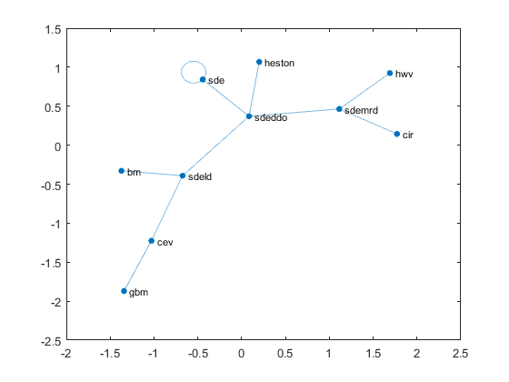

### Description
Matlab function to list subclasses and dependencies

### Syntax

`getSublasses(ROOTCLASS, [ROOTPATH])`

Lists all subclasses of `ROOTCLASS` and their node dependency. `ROOTCLASS` can be a string with the name of the class, an
object or a `meta.class()`.

It looks for subclasses in the `ROOTPATH` folder and in all its subfolders (at any depth). If `ROOTPATH` is not specified, it is set to the folder where ROOTCLASS is located. 
`ROOTCLASS` can also be a negative integer indicating how many folders above that of `ROOTCLASS` to begin the search.

### Output

Produces a table with `names`, `from` and `to` nodes, i.e. the current and the node of the direct subclass. 

If the `getSubclasses()` is called without an output, it will plot a `graph()` with the dependencies (requires version R2015b).

### Example
```matlab
which sde
C:\Program Files\MATLAB\R2016a\toolbox\finance\finsupport\@sde\sde.m  % sde constructor

getSubclasses('sde','C:\Program Files\MATLAB\R2016a\toolbox\finance\finsupport\');
```


Which we can compare with the ufficial documentation at [SDE class hierarchy](http://uk.mathworks.com/help/finance/sde-class-hierarchy.html), i.e.


